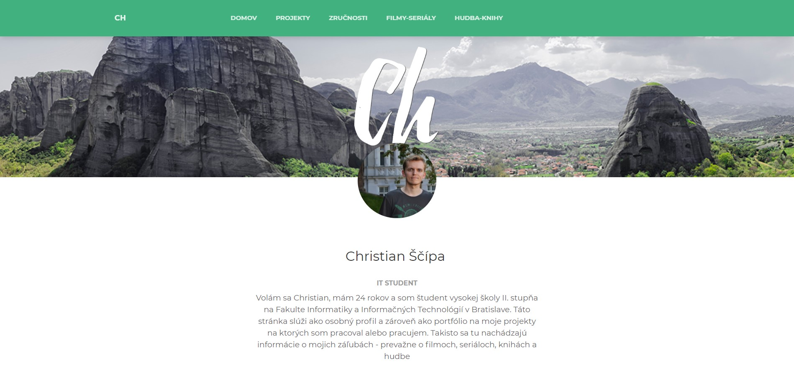
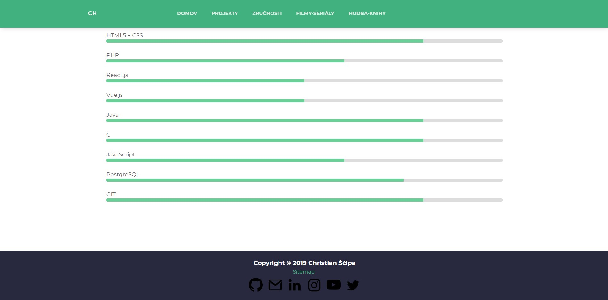
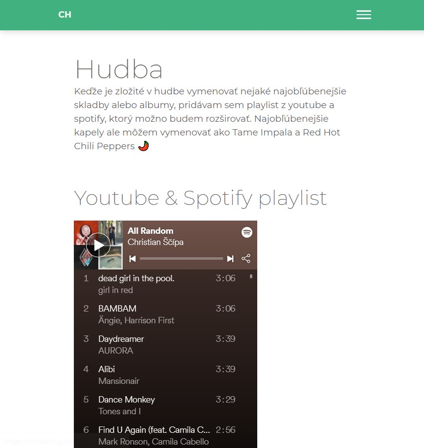

# chrisSvK.github.io

 * HTML 5
 * CSS
 * Jekyll  (https://jekyllrb.com/)
 * Bootstrap (https://getbootstrap.com/)
 * Paper Kit 2 design (https://demos.creative-tim.com/paper-kit-2/)
 
 ### Screenshots
 
 
 
 
 
 

